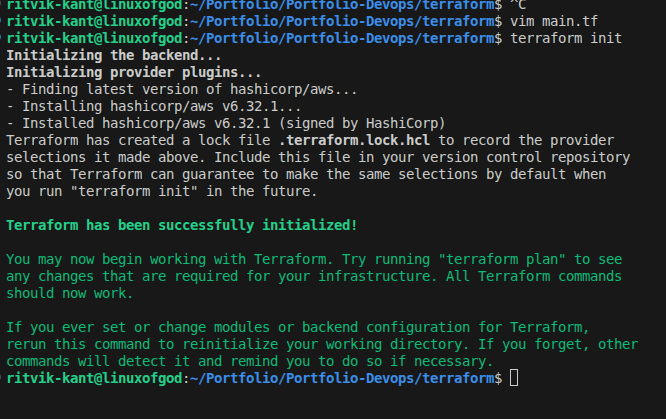
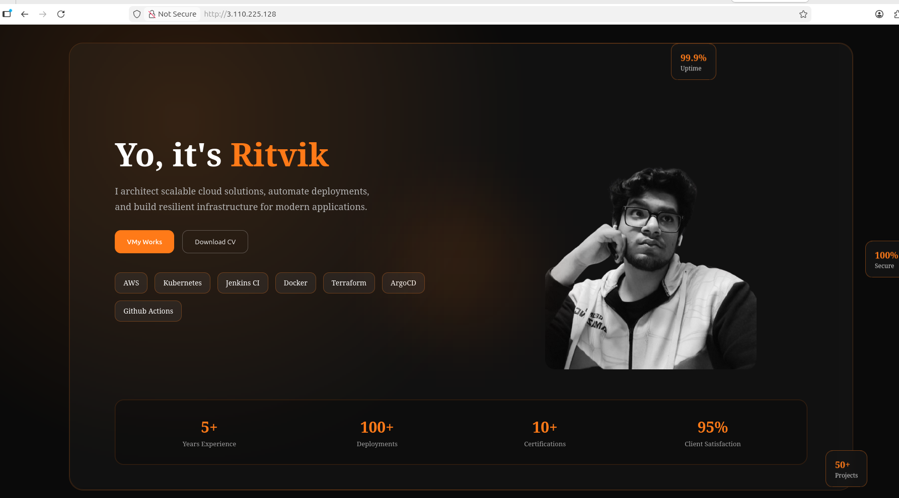

<h1 align="center">Automated React Deployment on AWS</h1>

Terraform provisions infrastructure • Ansible configures server • Nginx serves app

<i>Infrastructure becomes reproducible, server becomes replaceable.</i>

  
  
  
  

## Terraform Provisioning

## SSH Key Automation

## Configuration with Ansible

