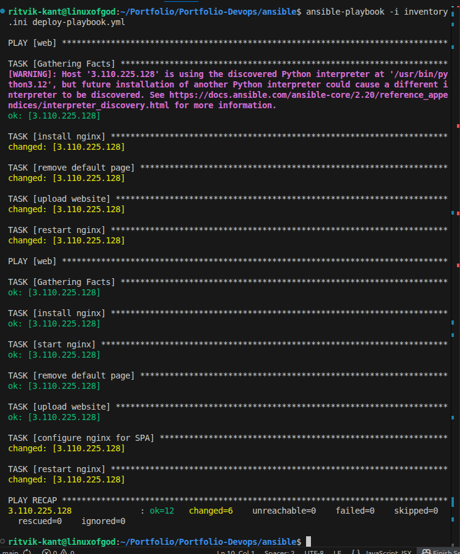

📦 Automated React Website Deployment (Terraform + Ansible)

This project demonstrates a fully automated deployment of a React portfolio website on AWS using Infrastructure as Code and Configuration Management.

Instead of manually creating a server, SSH-ing into it, installing dependencies and copying files, the entire system can be recreated using two commands.

terraform apply
ansible-playbook deploy-playbook.yml

The goal:

Make the server replaceable, not permanent.

🧠 Architecture
React Build → Terraform → AWS EC2 → Ansible → Nginx → Browser

Terraform provisions infrastructure and access
Ansible configures the machine and deploys the application

🏗️ What this project automates

EC2 provisioning

Security group configuration

SSH key creation (automatically generated)

Nginx installation

Static website deployment

SPA routing configuration

Fully repeatable environment setup

🔐 The SSH Problem (and Solution)

Normally AWS requires manually creating and downloading a keypair before SSH.

That breaks automation.

So instead:

Terraform TLS provider generates the SSH key locally

Public key is injected into EC2

Private key stays in project directory

Ansible uses it automatically

Now access itself is part of infrastructure.

📂 Project Structure
terraform-ansible-portfolio-deployment/
│
├── terraform/
│   ├── main.tf
│   ├── outputs.tf
│
├── ansible/
│   ├── inventory.ini
│   ├── deploy-playbook.yml
│   └── site/
│
├── screenshots/
└── README.md

⚙️ Step 1 — Build React App

The React app is converted into production static files.

npm run build

This produces HTML, CSS and JS files which will be served by nginx.

⚙️ Step 2 — Provision Infrastructure (Terraform)

Terraform creates:

EC2 instance

security group

SSH access

public IP output

Initialize terraform:

terraform init

Main configuration:

SSH Key Automation

Terraform generates key automatically:

This avoids manual AWS keypair download.

⚙️ Step 3 — Configure Server (Ansible)

After the instance is created, Ansible connects using the generated key and:

installs nginx

removes default page

uploads website

configures SPA routing

restarts server

ansible-playbook -i inventory.ini deploy-playbook.yml

🌐 Final Result

Website becomes live on the public IP generated by Terraform.

🔄 Reproducibility

Destroy server:

terraform destroy

Recreate:

terraform apply
ansible-playbook deploy-playbook.yml

Site works again — no manual steps.

🧩 Key Learnings

Infrastructure should be reproducible

Frontend production ≠ development server

React in production is static files

Provisioning and configuration are separate concerns

SSH access can be automated

Servers should be disposable

🚀 Future Improvements

Elastic IP

Custom domain + HTTPS

CI/CD deployment trigger

📌 Related Project

Frontend repository:
(put your portfolio repo link here)# terraform-ansible-portfolio-deployment
This repositiory shows the  step by step process I did to write an automation script to deploy my protfolio website
